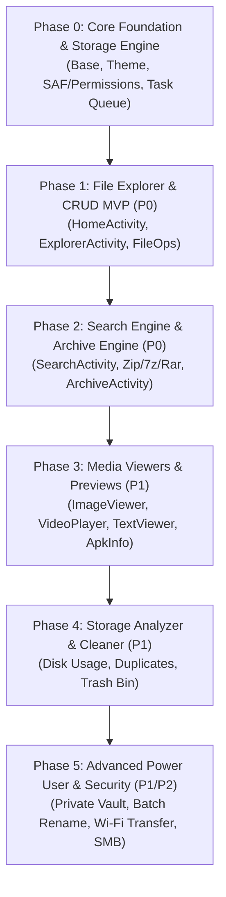

# ApexFileManager — Kế Hoạch Kỹ Thuật & Triển Khai Chi Tiết (Technical & Architectural Blueprint)

Tài liệu này được phát triển dựa trên phạm vi chức năng của [FILE_MANAGER_FEATURE_PLAN.md](file:///Users/nqmgaming/AndroidStudioProjects/ApexFileManager/plans/FILE_MANAGER_FEATURE_PLAN.md), cụ thể hóa thành kiến trúc kỹ thuật chuẩn Clean Architecture + MVI Contract + Multi-Activity Intent tuân thủ nghiêm ngặt quy định tại [GEMINI.md](file:///Users/nqmgaming/AndroidStudioProjects/ApexFileManager/GEMINI.md) và [.agents/rules/architecture.md](file:///Users/nqmgaming/AndroidStudioProjects/ApexFileManager/.agents/rules/architecture.md).

---

## 1. Nguyên Tắc Kỹ Thuật Bắt Buộc (Guiding Rules)
1. **Multi-Activity Intent Navigation**: CẤM dùng Compose Navigation. Mỗi màn hình chính/tính năng độc lập là một Activity kế thừa `BaseActivity`. Điều hướng kích hoạt từ `UiEvent` thông qua `Intent`.
2. **MVI / UDF Contract**: Mỗi màn hình gồm đúng 1 file `<Feature>Contract.kt` (`UiState`, `UiAction`, `UiEvent`), 1 `<Feature>ViewModel.kt` (kế thừa `BaseViewModel`), và 1 `<Feature>Screen.kt` (tách rõ Stateful và Stateless Content).
3. **Clean Architecture 3 Lớp**:
   - `domain/`: Pure Kotlin (không import Android SDK). Chứa Models, Repository interfaces, UseCases `<Verb><Noun>UseCase.kt`.
   - `data/`: Repositories, DataSources, Mappers, Storage Access Layer.
   - `presentation/`: Activities, ViewModels, Contracts, Composables.
4. **An toàn dữ liệu tuyệt đối (Data Integrity First)**:
   - Mọi thao tác File (Copy, Move, Delete, Nén) thực thi trong Background Service/WorkManager với thông báo Foreground Service Notification.
   - Khi Move file: Chỉ xóa file gốc sau khi đã verify file đích toàn vẹn thành công.
   - Hỗ trợ Rollback, Pause, Cancel, và Conflict Resolution (Ghi đè, Bỏ qua, Đổi tên tự động).
5. **No Hardcoded Values**:
   - 100% mã màu dùng semantic tokens `MaterialTheme.colorScheme.*`.
   - 100% chuỗi ký tự nằm trong `res/values/strings.xml`.
   - File code không vượt quá 500 dòng.

---

## 2. Lộ Trình Triển Khai 6 Giai Đoạn (6-Phase Technical Roadmap)



---

## 3. Chi Tiết Từng Giai Đoạn

### Phase 0: Core Foundation & Storage Abstraction Layer

#### Mục tiêu
Xây dựng hạ tầng cốt lõi: Base classes, Storage Access Layer (hỗ trợ Android 10 đến Android 16), Task Queue Service chạy nền cho tác vụ file, và Dependency Injection / Service Locator.

#### 1. Core Framework
- `core/base/UiContract.kt`: Marker interfaces `UiState`, `UiAction`, `UiEvent`.
- `core/base/BaseViewModel.kt`: StateFlow + Channel Event + `onAction()`.
- `core/base/BaseActivity.kt`: ComponentActivity + Edge-to-Edge + Theme wrapper.
- `core/designsystem/theme/`: Theme.kt, Color.kt, Type.kt chuẩn Material 3.
- `core/designsystem/components/`: Reusable TopAppBar, ConfirmationDialog, FileIconItem, EmptyState, LoadingIndicator, ErrorState.

#### 2. Storage Abstraction Layer (`core/storage/`)
- `StorageManagerCompat`:
  - Quản lý quyền: Kiểm tra và yêu cầu `MANAGE_EXTERNAL_STORAGE` (Android 11+ API 30), `READ_EXTERNAL_STORAGE`/`WRITE_EXTERNAL_STORAGE` (Android 10 API 29), `READ_MEDIA_*` (Android 13+).
  - Tự động fallback giữa `java.io.File`, `DocumentFile` (Storage Access Framework) và `MediaStore API`.
  - Phân tích ổ đĩa: Lấy dung lượng bộ nhớ trong (Internal Storage), Thẻ SD (External SDCard), USB OTG thông qua `StorageStatsManager` / `StatFs`.

#### 3. Background File Operations Engine (`core/operations/`)
- `FileOperationService` (Foreground Service):
  - Hiển thị Notification với progress bar thực thời (bytes copied / total bytes, current file name).
  - Hỗ trợ nút hành động trên Notification: `Tạm dừng`, `Hủy`.
  - Hàng đợi tác vụ (Queue): Đảm bảo các tác vụ nặng không bị Android OS kill khi app ở background.
- Conflict Strategy: `OVERWRITE`, `SKIP`, `AUTO_RENAME`, `KEEP_BOTH`.

---

### Phase 1: MVP File Explorer & File Operations (P0)

#### Mục tiêu
Người dùng có thể mở ứng dụng, xem tổng quan bộ nhớ, duyệt cây thư mục mượt mà (chịu tải 10.000+ file), thực hiện Copy, Move, Rename, Delete an toàn.

#### Cấu trúc Package & Màn Hình

```text
features/
├── home/
│   ├── HomeActivity.kt             # Launcher Activity
│   ├── HomeContract.kt             # HomeUiState, HomeUiAction, HomeUiEvent
│   ├── HomeViewModel.kt
│   ├── HomeScreen.kt               # Dung lượng bộ nhớ, Truy cập nhanh, Gần đây
│   └── components/                 # StorageProgressCard, CategoryGrid, RecentFileList
└── explorer/
    ├── ExplorerActivity.kt         # Màn hình duyệt file chính (nhận EXTRA_PATH)
    ├── ExplorerContract.kt         # ExplorerUiState, ExplorerUiAction, ExplorerUiEvent
    ├── ExplorerViewModel.kt
    ├── ExplorerScreen.kt           # Danh sách file (List/Grid, Multi-select, Breadcrumbs)
    └── components/                 # BreadcrumbBar, FileListItem, FileGridItem, BottomActionBar
```

#### Domain Layer (`domain/`)
- **Models:**
  - `FileItem(id, name, path, sizeBytes, isDirectory, mimeType, modifiedDate, isHidden, isFavorite)`
  - `StorageVolume(name, path, totalBytes, freeBytes, isRemovable)`
  - `FileOperation(type: COPY|MOVE|DELETE, sources: List<String>, targetDir: String?, strategy: ConflictStrategy)`
  - `OperationProgress(currentFile, processedBytes, totalBytes, progressPercentage)`
- **Repository Interfaces:**
  - `FileRepository`: `fun getFilesInDirectory(path: String, query: FileQueryFilter): Flow<List<FileItem>>`
  - `StorageRepository`: `fun getStorageVolumes(): Flow<List<StorageVolume>>`
  - `FileOperationRepository`: `fun enqueueOperation(op: FileOperation): Flow<OperationProgress>`
- **UseCases:**
  - `GetDirectoryContentsUseCase.kt` (hỗ trợ Sort: Tên, Ngày, Kích thước, Loại; Filter: Ẩn/Hiện file ẩn)
  - `GetStorageOverviewUseCase.kt`
  - `CopyFilesUseCase.kt`
  - `MoveFilesUseCase.kt`
  - `DeleteFilesUseCase.kt`
  - `RenameFileUseCase.kt`
  - `CreateFolderUseCase.kt`

#### Contracts Chi Tiết
```kotlin
// ExplorerContract.kt
data class ExplorerUiState(
    val currentPath: String = "",
    val pathSegments: List<PathSegment> = emptyList(),
    val files: List<FileItem> = emptyList(),
    val selectedFiles: Set<FileItem> = emptySet(),
    val isSelectionMode: Boolean = false,
    val viewMode: ViewMode = ViewMode.LIST, // LIST, GRID
    val sortOption: SortOption = SortOption.NAME_ASC,
    val showHiddenFiles: Boolean = false,
    val isLoading: Boolean = false,
    val errorMessage: String? = null
) : UiState

sealed interface ExplorerUiAction : UiAction {
    data class OpenDirectory(val path: String) : ExplorerUiAction
    data class OpenFile(val file: FileItem) : ExplorerUiAction
    data class SelectFile(val file: FileItem) : ExplorerUiAction
    data object ToggleSelectAll : ExplorerUiAction
    data object ClearSelection : ExplorerUiAction
    data class ChangeViewMode(val mode: ViewMode) : ExplorerUiAction
    data class ChangeSort(val sort: SortOption) : ExplorerUiAction
    data object ToggleHiddenFiles : ExplorerUiAction
    data class CopySelected(val targetPath: String) : ExplorerUiAction
    data class MoveSelected(val targetPath: String) : ExplorerUiAction
    data object DeleteSelected : ExplorerUiAction
    data class RenameFile(val file: FileItem, val newName: String) : ExplorerUiAction
    data class CreateFolder(val name: String) : ExplorerUiAction
}

sealed interface ExplorerUiEvent : UiEvent {
    data class OpenViewer(val path: String, val mimeType: String) : ExplorerUiEvent
    data class ShowMessage(val messageResId: Int) : ExplorerUiEvent
    data class ShowConfirmDeleteDialog(val count: Int) : ExplorerUiEvent
    data class ShareFiles(val fileUris: List<Uri>) : ExplorerUiEvent
}
```

---

### Phase 2: Tìm Kiếm Toàn Diện & Trình Nén Archive (P0)

#### 1. Tính Năng Tìm Kiếm (`features/search/`)
- `SearchActivity.kt`, `SearchContract.kt`, `SearchViewModel.kt`, `SearchScreen.kt`.
- **Search Engine**:
  - Hỗ trợ tìm kiếm tiếng Việt có dấu và không dấu (Vietnamese Unaccent Normalization: bỏ dấu tiếng Việt để tìm "tai lieu" ra "tài liệu").
  - Tìm theo phần mở rộng, khoảng kích thước (`< 1MB`, `1MB - 100MB`, `> 100MB`), thời gian sửa đổi (`Hôm nay`, `Tuần này`, `Tháng này`).
  - Lịch sử tìm kiếm lưu trữ cục bộ qua DataStore/Room.
  - Sử dụng Coroutine Flow với `debounce(300ms)` chống nghẽn UI.

#### 2. Archive Engine (`features/archive/`)
- `ArchiveActivity.kt`: Xem nội dung file nén mà không cần giải nén ra đĩa.
- Thư viện tích hợp: `Apache Commons Compress` + `Zip4j` (hỗ trợ ZIP, 7z, giải nén RAR, nén có mật khẩu AES).
- **UseCases:**
  - `ListArchiveEntriesUseCase.kt`: Đọc metadata của file zip/7z/rar dưới dạng cây thư mục ảo.
  - `ExtractArchiveUseCase.kt`: Giải nén toàn bộ hoặc trích xuất từng file riêng lẻ có progress.
  - `CreateArchiveUseCase.kt`: Tạo file ZIP/7z có password hoặc không.

---

### Phase 3: Trình Xem File (Media Previews & Viewers - P1)

Thay vì buộc người dùng thoát app sang ứng dụng khác, ApexFileManager cung cấp các Activity xem nhanh:

1. **`ImageViewerActivity.kt`**:
   - Sử dụng Coil với Subsampling Scale ImageView / Zoomable Composable.
   - Hỗ trợ vuốt xem ảnh tiếp theo trong cùng thư mục, xoay ảnh, xem EXIF metadata.
2. **`VideoPlayerActivity.kt`**:
   - Tích hợp `Media3 / ExoPlayer` gọn nhẹ, điều khiển âm lượng, độ sáng bằng cử chỉ vuốt.
3. **`TextViewerActivity.kt`**:
   - Xem file text, log, json, xml với line numbers và code syntax highlighting cơ bản.
4. **`ApkViewerActivity.kt`**:
   - Đọc `PackageInfo` từ file APK offline: icon ứng dụng, tên app, package name, version, versionCode, targetSdk, permissions yêu cầu.
   - Nút `Cài đặt APK` (kích hoạt `ACTION_INSTALL_PACKAGE` an toàn).

---

### Phase 4: Phân Loại & Dọn Dẹp Dung Lượng (Cleaner & Analyzer - P1)

1. **Phân loại nội dung tự động (`features/category/`)**:
   - `CategoryActivity.kt`: Hiển thị danh mục (Ảnh, Video, Âm thanh, Tài liệu, APKs, Tệp tải về).
   - Sử dụng Android `MediaStore` để truy vấn nhanh hàng nghìn file media không cần quét từng thư mục vật lý.
2. **Dọn dẹp dung lượng (`features/cleaner/`)**:
   - `StorageAnalyzerActivity.kt`: Phân tích cây dung lượng hình tròn (Sunburst / Bar chart).
   - Tìm kiếm: File siêu lớn (> 100MB, > 1GB), File rác cache tạm (`.tmp`, `.log`, `.cache`), File trùng lặp (dựa trên kích thước + MD5/SHA256 checksum).
   - **Thùng rác (Trash Bin)**: Chuyển file vào thư mục ẩn `.apex_trash/` có lưu metadata để khôi phục hoặc xóa vĩnh viễn, tránh mất file vô tình.

---

### Phase 5: Tính Năng Nâng Cao (Power User & Security - P1/P2)

1. **Kho Riêng Tư (Private Safe Vault)**:
   - Mã hóa file chuẩn `AES-256 GCM` với `Android Keystore`.
   - Xác thực sinh trắc học (BiometricPrompt / Vân tay / Khuôn mặt / PIN).
   - Tự động khóa khi app vào trạng thái `onStop()`.
2. **Đổi tên hàng loạt (Batch Rename)**:
   - Thêm tiền tố, hậu tố, số thứ tự tăng dần (`file_01.jpg`, `file_02.jpg`), thay thế chuỗi regex.
   - Xem trước danh sách tên mới trước khi bấm xác nhận.
3. **Chia sẻ Wi-Fi nội bộ & Web Server (Local Share)**:
   - Khởi chạy HTTP Server cục bộ (Ktor Embedded Server hoặc NanoHTTPD) cho phép máy tính cùng mạng Wi-Fi duyệt và tải/tải lên file qua trình duyệt web mà không cần cáp USB.

---

## 4. Đặc Tả Thư Viện Cần Bổ Sung (`libs.versions.toml`)

Để hỗ trợ lộ trình trên mà không làm nặng app, các thư viện được chọn lọc kỹ:

| Thư viện | Mục đích | Module / Phiên bản khuyến nghị |
| :--- | :--- | :--- |
| **Lifecycle Compose** | ViewModel Compose integration | `androidx.lifecycle:lifecycle-viewmodel-compose:2.11.0` |
| **Coil Compose** | Hiển thị thumbnail ảnh, video, APK icon | `io.coil-kt:coil-compose:2.7.0` |
| **Material Icons Extended**| Bộ icon phong phú (folder, file types, sort, view) | `androidx.compose.material:material-icons-extended` |
| **Zip4j / Commons Compress**| Nén & giải nén ZIP/7z có mật khẩu | `net.lingala.zip4j:zip4j:2.11.5` |
| **Media3 ExoPlayer** (Phase 3)| Phát video/audio mượt mà | `androidx.media3:media3-exoplayer:1.5.1` |
| **Biometric** (Phase 5) | Xác thực vân tay kho riêng tư | `androidx.biometric:biometric:1.2.0-alpha05` |

---

## 5. Quy Trình Kiểm Thử & Tiêu Chí Nghiệm Thu (Acceptance Criteria)

### 1. Kiểm thử độ bền file (Zero Data Loss)
- Cắt điện đột ngột hoặc kill app khi đang Move file: File gốc vẫn nguyên vẹn 100%, không bị xóa nếu đích chưa hoàn tất.
- Copy file trùng tên: Hiển thị đầy đủ 3 tùy chọn (Ghi đè, Bỏ qua, Đổi tên tự động).

### 2. Hiệu năng (Performance Benchmarks)
- Thư mục 10.000 file: Thời gian load lần đầu `< 800ms`, scroll mượt mà 60/120fps nhờ `LazyColumn` với `key` ổn định.
- Tìm kiếm tiếng Việt: Gõ "anh" tìm ra cả "ảnh", "ánh", "anh.jpg" trong vòng `< 300ms`.

### 3. Tuân thủ Google Play Policy
- Khai báo và mô tả đúng mục đích sử dụng quyền `MANAGE_EXTERNAL_STORAGE` với video demo luồng thao tác file cốt lõi của File Manager.

---

## 6. Trình Tự Bắt Đầu Ngay (Immediate Next Steps)
1. **Bước 1**: Thiết lập tầng Base (`BaseActivity`, `BaseViewModel`, `UiContract`) và bổ sung thư viện `lifecycle-viewmodel-compose`, `material-icons-extended`.
2. **Bước 2**: Xây dựng `StorageManagerCompat` xử lý quyền bộ nhớ trên Android 10 - 15+.
3. **Bước 3**: Triển khai `HomeActivity` (Trang chủ: Tổng quan bộ nhớ + Danh mục + File gần đây) tuân thủ MVI Contract.
4. **Bước 4**: Triển khai `ExplorerActivity` (Duyệt thư mục + Thao tác file cơ bản).
